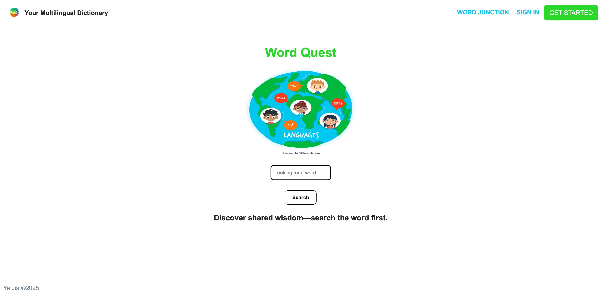
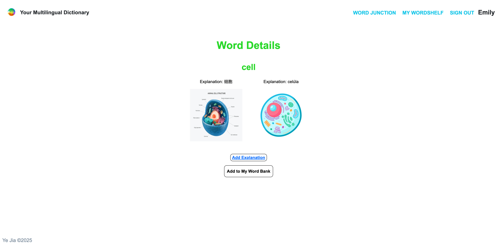
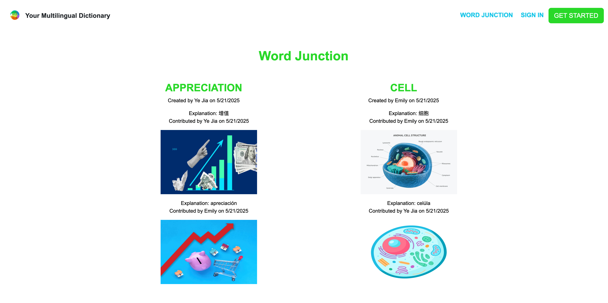
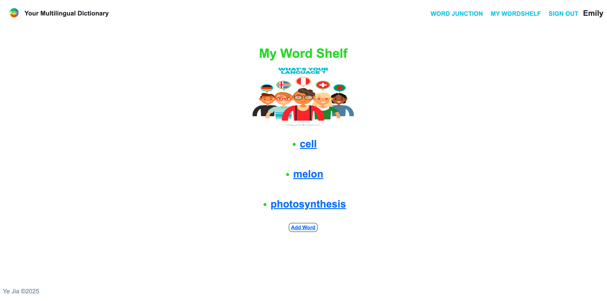
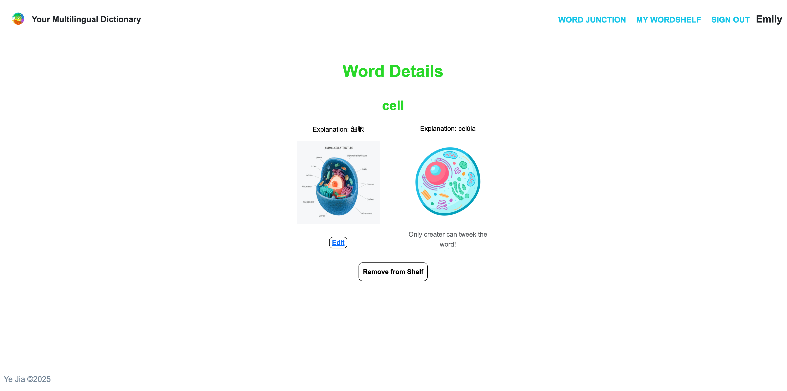

  

  

  # BLACKJACK

  ### [CLICK TO PlAY](https://your-multilingual-dictionary-edec17a4e7e6.herokuapp.com/)

## Description
Multilingual Dictionary is an inclusive, community-driven platform designed to support newcomer students and language learners through multilingualism and translanguaging. It allows users to create, explore, and contribute word entries with explanations, translations, and images across multiple languages. By embracing users’ diverse language backgrounds, the platform promotes deeper understanding and meaningful learning. Each word entry highlights its creator and contributors, fostering collaboration and empowering newcomers to connect their home languages with new languages in school and community settings.

## Screenshot
| Description    | Screenshots                                      |
|---------------|-------------------------------------------------|
| Home Page     |  |
| Search Result |  |
| Word Junction |  |
| Word Shelf    |  |
| Word Detail   |  |

## Technologies Used

  
  
  
  
  
  
  

## Getting Started

### Instructions

1. Search the Dictionary
Visitors can freely browse and search for words and their meanings in different languages without logging in.

2. Log in to Contribute
Once you're logged in, you can add new word entries or contribute additional meanings and images to existing words.

3. Personal Wordshelf
Every user has a personal Wordshelf — a space where you can view, edit, and delete the words you've created.

4. Add to Your Dictionary
You can also save words contributed by others to your own dictionary collection for easy access later.

5. Community Contributions
Each word entry clearly shows who originally created the word and who contributed additional meanings, fostering a collaborative and transparent learning environment.

### Link

- Deployed Link https://your-multilingual-dictionary-edec17a4e7e6.herokuapp.com/

## Upcoming Features

### Tag System
Users will be able to add tags (e.g., slang, formal, idiom, science) to words to improve search, categorization, and learning context.
### Pagination for Word Pages
Word Junction will support pagination, making it easier to browse through a large number of word entries without overwhelming the page.
### User Word Collections
Users will be able to group saved words into custom folders or themed collections within their Wordshelf.
### Search by Language or Contributor
Advanced filtering options will let users search words by language, creator, or contributor.
